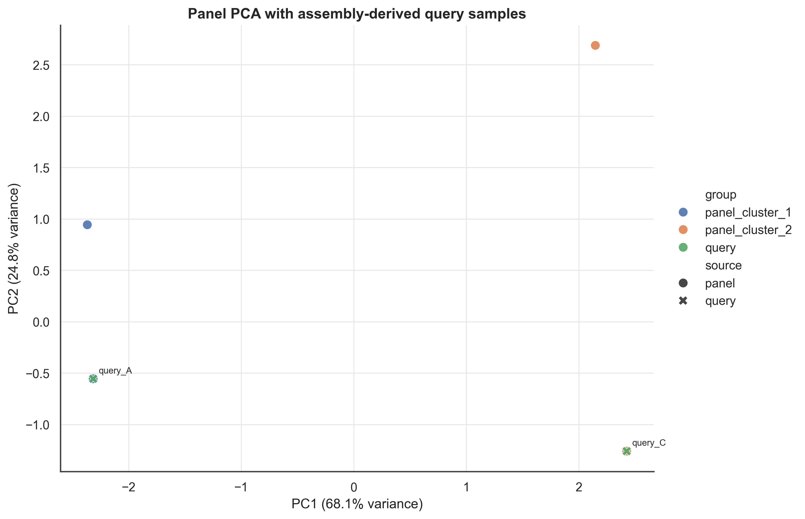

# Genotype Assembly to SNP-Chip Panel

> [!NOTE]
> This repository is under active development. Suggestions, corrections, teaching examples, and issue reports are welcome through GitHub Issues or pull requests.

`genotype-assembly2snpchip` is a lightweight workflow for asking a practical identity question:

> Does this genome assembly match the accession, line, cultivar, or individual we think it is?

It maps one or more genome assemblies to a reference genome, genotypes the assemblies at known SNP-chip marker positions, compares those marker profiles to a multi-sample panel VCF with `bcftools gtcheck`, and summarizes the closest matches.

The workflow was motivated by soybean/SoySNP50K work on Sapelo2, but the scripts and documentation are written for the generic case: any species, any SNP-chip-style panel VCF, and any SLURM-style HPC where `minimap2`, `samtools`, `bcftools`, and Python are available.

## Why

This repository is for identity checking, not whole-genome variant discovery.

Instead of asking "what differs from the reference?", it asks:

> At the exact SNP-chip marker positions, what genotype does this assembly have?

That distinction matters because reference-state genotypes are informative for identity matching. A sparse variant-only VCF often throws away exactly the evidence you need for a clean comparison to a SNP-chip panel.

## What You Need

- one or more query assembly FASTA files
- the reference FASTA used by, or coordinate-compatible with, the SNP-chip panel
- a bgzipped and indexed multi-sample SNP-chip / marker-panel VCF
- an HPC or Linux environment with `minimap2`, `samtools`, `bcftools`, `htslib`, and Python 3

## Install

### Option A: Mamba

```bash
mamba env create -f environment.yml
mamba activate genotype-assembly2snpchip
```

### Option B: Pixi

```bash
pixi install
pixi shell
```

### Option C: pip

```bash
python -m pip install -r requirements.txt
```

### Check the Python Packages

```bash
python -c "import pandas, matplotlib, seaborn, sklearn, openpyxl; print('Python packages OK')"
```

## Quick Start

### Prepare the expected inputs

Place your main inputs in these locations or edit the sbatch variables to point elsewhere:

```text
reference/genome.fa
assemblies/*.fa
data/snp_chip_panel.vcf.gz
data/snp_chip_panel.vcf.gz.tbi
```

Create the FASTA index if needed:

```bash
samtools faidx reference/genome.fa
```

Before submitting jobs, review these items in each sbatch script:

- `#SBATCH --partition`, `--account`, `--cpus-per-task`, `--mem`, `--time`
- module names or environment activation commands
- workflow variables such as `REFERENCE_FASTA`, `ASSEMBLY_DIR`, `BAM_DIR`, `PANEL_VCF`, `RESULTS_DIR`, `PANEL_DIR`, `MIN_MQ`, and `MIN_GQ`

### 1. Map assemblies

```bash
sbatch sbatch/map_assemblies_to_reference.sbatch
```

Edit first:

```text
REFERENCE_FASTA=reference/genome.fa
ASSEMBLY_DIR=assemblies
BAM_DIR=bams
PRESET=asm20
```

Expected outputs:

```text
bams/<sample>.bam
bams/<sample>.bam.bai
```

### 2. Genotype panel sites and run `gtcheck`

```bash
sbatch sbatch/call_panel_variants_and_gtcheck.sbatch
```

Edit first:

```text
REFERENCE_FASTA=reference/genome.fa
PANEL_VCF=data/snp_chip_panel.vcf.gz
BAM_DIR=bams
RESULTS_DIR=results
PANEL_DIR=work/panel
MIN_MQ=5
MIN_GQ=20
```

Expected outputs:

```text
work/panel/panel.biallelic.snps.vcf.gz
results/<sample>.panel.filtered.diploid.vcf.gz
results/<sample>*.gtcheck.tsv
```

### 3. Summarize top hits

```bash
python scripts/summarize_gtcheck_top_hits.py \
  -i 'results/*.gtcheck.tsv' \
  -n 10 \
  --min-sites 1000 \
  -o results/gtcheck_top10.tsv
```

Expected outputs:

```text
results/gtcheck_top10.tsv
results/gtcheck_top10.sample_summary.tsv
```

Example rows from `results/gtcheck_top10.tsv`:

| query_sample | panel_sample | rank | sites_compared | match_fraction | confidence_score |
| --- | --- | ---: | ---: | ---: | ---: |
| Benning | PI 644044 | 1 | 41147 | 0.98663329 | 4.5499044 |
| Benning | PI 595645 | 2 | 41147 | 0.98619583 | 4.5478866 |
| Clark | PI 424405 B | 1 | 41055 | 0.98996468 | 4.5717346 |
| Jackv3 | Dwight | 1 | 40982 | 0.98872627 | 4.5553174 |

### 4. Optional: add GRIN metadata

```bash
python scripts/enrich_gtcheck_top_hits_with_grin.py \
  --input results/gtcheck_top10.tsv \
  --crop soybean
```

Expected outputs:

```text
results/gtcheck_top10.grin_enriched.tsv
results/gtcheck_top10.grin_enriched.xlsx
results/gtcheck_top10.grin_cache.json
```

Example rows from `results/gtcheck_top10.grin_enriched.tsv`:

| query_sample | panel_sample | genotyped_sample | PLANT NAME | TAXONOMY | ORIGIN | GRIN LOOKUP STATUS |
| --- | --- | --- | --- | --- | --- | --- |
| Benning | PI 644044 | PI 644044 | G95-Ben2403 | Glycine max (L.) Merr. | Georgia, United States | ok |
| Benning | PI 595645 | PI 595645 | Benning | Glycine max (L.) Merr. | Georgia, United States | ok |
| Clark | PI 424405 B | PI 424405 B | KAS 530-16 | Glycine max (L.) Merr. | Jeollabuk-do, Korea, South | ok |
| Jackv3 | Dwight | PI 597386 | Dwight | Glycine max (L.) Merr. | Illinois, United States | ok |

### 5. Optional: plot summary figures

```bash
python scripts/plot_gtcheck_summary.py \
  --top-hits results/gtcheck_top10.tsv \
  --sample-summary results/gtcheck_top10.sample_summary.tsv \
  --out-dir figures \
  --prefix gtcheck
```

Expected outputs:

```text
figures/gtcheck_top_hits_lollipop.png
figures/gtcheck_rank1_rank2_gap.png
figures/gtcheck_match_fraction_vs_sites.png
figures/gtcheck_top_hit_heatmap.png
```

#### Figure: Top Hits Per Assembly


This lollipop plot shows the top-ranked SNP-chip panel matches for each query assembly. Each row is one assembly, each point is one panel sample among the top hits, point color represents rank, and point size reflects `sites_compared`. A strong identity result appears as a rank-1 point with high `match_fraction`, many compared sites, and visible separation from lower-ranked hits.

### 6. Optional: plot PCA / MDS context

```bash
python scripts/plot_panel_pca_mds.py \
  --panel-vcf work/panel/panel.biallelic.snps.vcf.gz \
  --query-vcfs results/*.panel.filtered.diploid.vcf.gz \
  --out-dir figures \
  --prefix panel_context \
  --method pca
```

Expected outputs:

```text
figures/panel_context_pca_coordinates.tsv
figures/panel_context_pca_pc1_pc2.png
figures/panel_context_pca_pc2_pc3.png
figures/panel_context_matrix_summary.tsv
```

#### Figure: PCA Context for Query Assemblies



PCA places the query samples into the same coordinate space as the SNP-chip panel samples. In a real project, a query assembly that matches a SNP-chip accession should fall near that accession or its expected genetic cluster. Large separation from the expected panel group suggests checking marker overlap, missing data, labels, and reference-genome compatibility.

## Important Requirement

The reference genome used to map the assemblies must match the reference coordinate system used by the SNP-chip panel VCF.

Best practice is to use the exact same reference FASTA used to create or coordinate the panel. If the panel and mapping reference are on different assemblies, lift over or rebuild the panel first.

## Repository Layout

```text
.
├── scripts/   species-agnostic Python utilities
├── sbatch/    example SLURM scripts for mapping and panel genotyping
├── docs/      long-form documentation
├── examples/  soybean-specific case-study material
└── tests/     tiny regression fixtures and checks
```

## Documentation

- Docs landing page: [docs/workflow.md](docs/workflow.md)
- Workflow overview: [docs/overview.md](docs/overview.md)
- Setup and environment: [docs/setup.md](docs/setup.md)
- Inputs: [docs/inputs.md](docs/inputs.md)
- Step-by-step workflow: [docs/step-1-map-assemblies.md](docs/step-1-map-assemblies.md), [docs/step-2-prepare-panel-and-call-sites.md](docs/step-2-prepare-panel-and-call-sites.md), [docs/step-3-compare-and-summarize.md](docs/step-3-compare-and-summarize.md)
- Visualization: [docs/visualization.md](docs/visualization.md)
- Interpreting results: [docs/interpreting-results.md](docs/interpreting-results.md)
- Testing: [docs/testing.md](docs/testing.md)
- HPC adaptation notes: [docs/hpc_notes.md](docs/hpc_notes.md)
- Soybean example materials: [examples/README.md](examples/README.md)

## Tests

```bash
pixi run test-parser
pixi run test-plots
pixi run test-pca
pixi run test-grin
```

## Contributing

Suggestions and pull requests are welcome. For the project background, usage details, and teaching notes, start with [docs/workflow.md](docs/workflow.md).

## Citation

If this repository helps your work, please cite the repository and describe the specific SNP-chip panel, reference genome, and software versions used in your analysis.

## License

[MIT](LICENSE)
