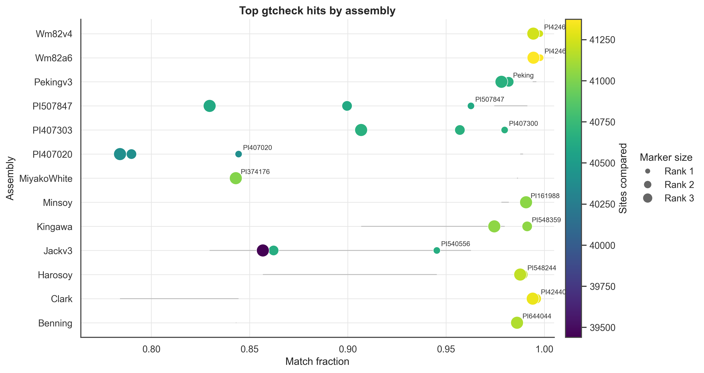
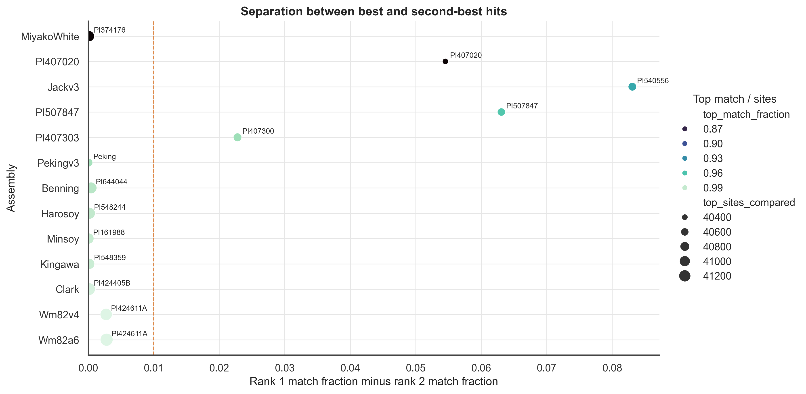
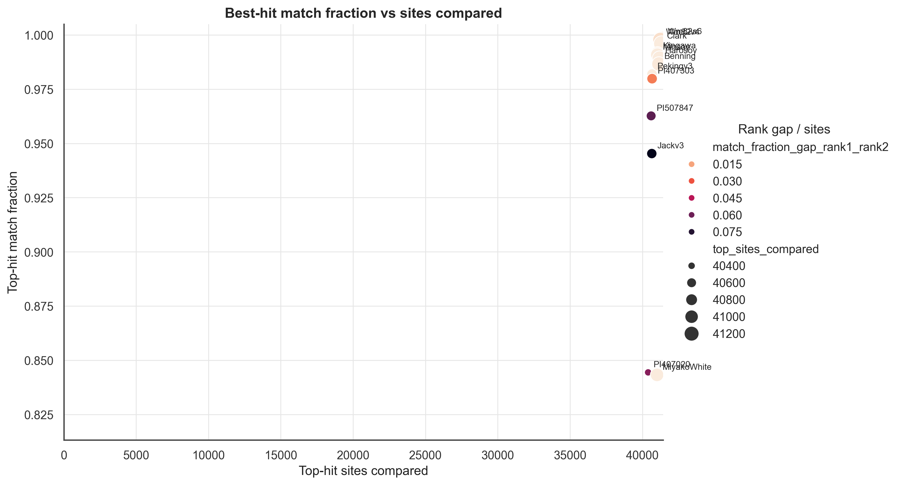
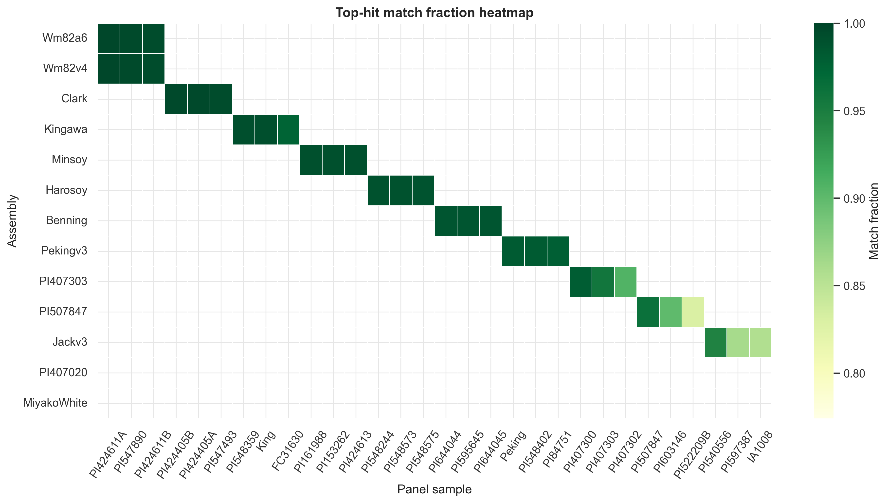
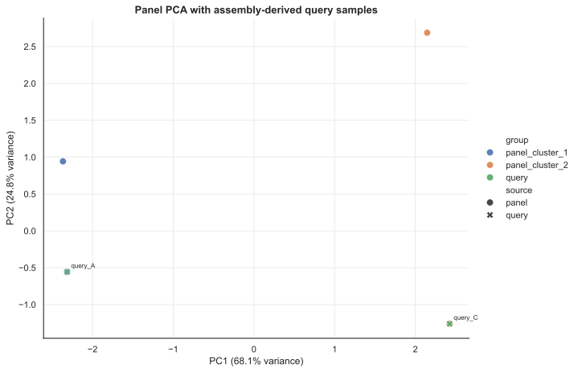
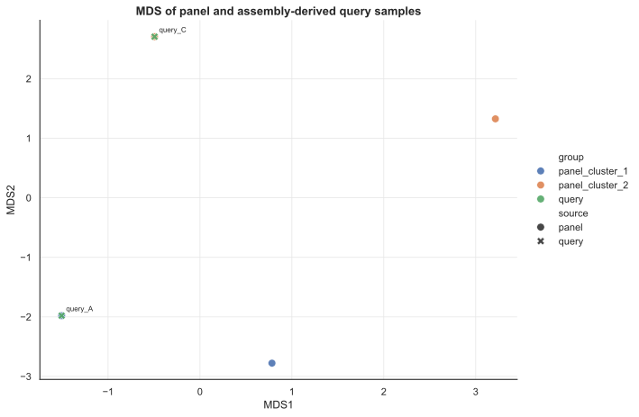

# Visualization

## Plot the `gtcheck` Summary

After generating the ranked hit table and sample summary, create summary figures:

```bash
python scripts/plot_gtcheck_summary.py \
  --top-hits results/gtcheck_top10.tsv \
  --sample-summary results/gtcheck_top10.sample_summary.tsv \
  --out-dir figures \
  --prefix gtcheck
```

Typical outputs:

```text
figures/gtcheck_top_hits_lollipop.png
figures/gtcheck_rank1_rank2_gap.png
figures/gtcheck_match_fraction_vs_sites.png
figures/gtcheck_top_hit_heatmap.png
```

These plots help answer:

- is there a clean rank-1 hit?
- how large is the rank-1 vs rank-2 gap?
- how many sites support the match?
- do multiple queries share the same top-hit neighborhood?

## Example `gtcheck` Figures

The repository includes example figures generated from the bundled SoySNP50K `gtcheck` outputs in `examples/results/`. These are demonstration figures only; they show what the plotting script produces, not a universal expectation for every species or SNP-chip panel.

### Figure 1. Top Hits Per Assembly



This lollipop plot shows the top-ranked SNP-chip panel matches for each query assembly. Each row is one assembly, each point is one panel sample among the top hits, point color represents `sites_compared`, and point size increases with rank. A strong identity result appears as a rank-1 point with high `match_fraction`, many compared sites, and visible separation from lower-ranked hits. Rows with several points clustered tightly together suggest ambiguous identity, close relatives, or duplicate/near-duplicate panel entries.

### Figure 2. Rank-1 Versus Rank-2 Separation



This plot shows the difference between the best and second-best `match_fraction` for each assembly. Larger values mean the top hit is well separated from the next candidate, which supports a cleaner identity assignment. Very small gaps mean the first and second hits are nearly tied; in those cases, the result may still be useful, but it should be interpreted as a related-line or cluster-level match rather than a uniquely resolved accession.

### Figure 3. Match Fraction Versus Sites Compared



This scatterplot is the fastest QC overview. The x-axis shows how many SNP-chip markers supported the top comparison, and the y-axis shows the top-hit `match_fraction`. The strongest results are in the upper-right: high concordance supported by many sites. Points with high match fraction but few sites may be promising but under-supported. Points with many sites but lower match fraction often deserve biological or metadata follow-up because the evidence is strong enough to suggest a real mismatch, divergence, or panel-label issue.

### Figure 4. Top-Hit Match Fraction Heatmap



This heatmap summarizes the top-hit neighborhood across assemblies. Rows are query assemblies and columns are panel samples that appeared among the top-ranked hits. Darker green cells indicate higher `match_fraction`, and outlined cells mark rank-1 hits. This view is useful for spotting repeated best hits, clusters of related accessions, and assemblies that share the same small group of candidate panel matches.

## PCA and MDS Context

You can also place assembly-derived query genotypes into the context of the full SNP-chip panel:

```bash
python scripts/plot_panel_pca_mds.py \
  --panel-vcf work/panel/panel.biallelic.snps.vcf.gz \
  --query-vcfs results/*.panel.filtered.diploid.vcf.gz \
  --out-dir figures \
  --prefix panel_context \
  --method pca
```

For smaller focused subsets, you can request both PCA and MDS:

```bash
python scripts/plot_panel_pca_mds.py \
  --panel-vcf work/panel/panel.biallelic.snps.vcf.gz \
  --query-vcfs results/*.panel.filtered.diploid.vcf.gz \
  --out-dir figures \
  --prefix panel_context \
  --method both \
  --max-mds-samples 500
```

## PCA or MDS?

- Use PCA as the default for most projects
- Use MDS for smaller, focused subsets when a distance-style view is helpful
- Treat both as supportive context, not the primary identity call

## Example PCA and MDS Figures

The example below uses the tiny synthetic VCF files in `tests/fixtures/`. It is intentionally small, so the exact geometry is not biologically meaningful. The point of the example is to show the expected pattern: assembly-derived query samples should plot near the panel samples or panel clusters that match them.

### Figure: PCA Context for Query Assemblies



**Caption:** PCA places the synthetic query samples into the same coordinate space as the SNP-chip panel samples. In a real project, a query assembly that matches a SNP-chip accession should fall near that accession or its expected genetic cluster. Here, `query_A` falls with the first synthetic panel cluster and `query_C` falls toward the second synthetic panel cluster. Large separation from the expected panel group would suggest checking sample labels, marker overlap, missing data, and reference-genome compatibility.

### Figure: MDS Context for Query Assemblies



**Caption:** MDS provides a distance-oriented view of the same synthetic genotype matrix. Nearby points should have more similar genotype profiles than distant points, but MDS is best used on small or focused subsets because it scales with sample-by-sample relationships. In a real project, use this plot as a companion check after `gtcheck`, not as the primary identity decision.

## Common Plot Issues

| Symptom | Likely cause | What to check |
| --- | --- | --- |
| Query is a strong outlier | weak marker overlap, wrong reference, contamination, mislabeled sample | compare `sites_compared`, inspect call rate, confirm the panel reference genome |
| Query does not appear | no overlapping sites, filtered markers, unexpected VCF sample name | inspect the coordinates TSV and VCF header |
| PCA is dominated by one sample | low-quality or very divergent sample | inspect PC2/PC3, use a smaller subset |
| MDS is slow | pairwise scaling problem on large panels | use PCA or subset the panel |
| Colors or labels are missing | metadata sample names do not match | compare metadata names to the coordinates TSV |
